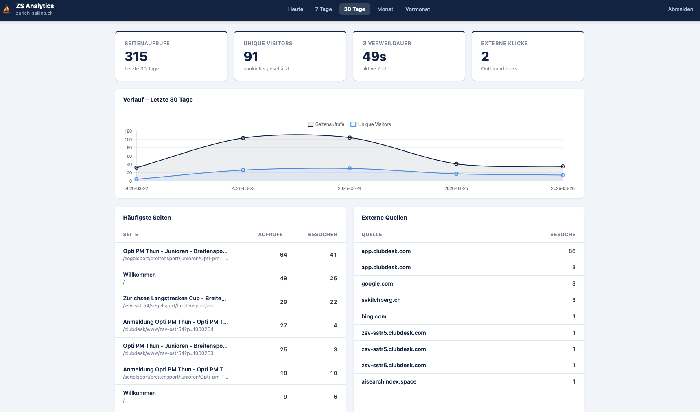

# Clubdesk Analytics

Self-hosted, cookielose Besucherstatistiken für Websites auf [Clubdesk](https://www.clubdesk.com/).



## Voraussetzungen
- PHP 8.1+
- MariaDB 10.4+ oder MySQL 8+
- PHP-Extensions: `pdo_mysql`, `json`, `mbstring`
- Webhosting mit HTTPS (z.B. cyon.ch, Infomaniak, Hosttech)

## Stack
- PHP 8.x + MariaDB
- Vanilla JavaScript Tracking-Snippet (~100 Zeilen)
- Kein Cookie, kein Cookie-Banner (DSG-konform)

## Setup

### 1. Subdomain anlegen
- Subdomain anlegen (z.B. `stats.YOUR-DOMAIN.COM`)
- Document Root auf das `public/`-Verzeichnis zeigen lassen
- HTTPS/Let's Encrypt aktivieren

### 2. Datenbank anlegen
Im Hosting-Control-Panel eine MariaDB-Datenbank erstellen.

### 3. Konfiguration
```bash
cp config/config.sample.php config/config.php
```
`config/config.php` ausfüllen:
- DB-Zugangsdaten eintragen
- `salt` = langer, zufälliger String: `openssl rand -hex 32`
- `install_token` = beliebiges Passwort für einmaligen Setup-Aufruf
- `site_name` = Anzeigename im Dashboard (z.B. `"Mein Segelclub"`)
- `self_domain` = eigene Domain für Referrer-Filter (z.B. `"mein-club.ch"`)
- `allowed_origins` = CORS-Whitelist für den Tracker
- Passwort-Hash generieren:
  ```bash
  php -r "echo password_hash('DEIN_PASSWORT', PASSWORD_DEFAULT);"
  ```
  Als `password_hash` eintragen.

### 4. Tabellen erstellen
Einmalig aufrufen (danach Datei löschen oder über Hosting-Panel sperren):
```
https://stats.YOUR-DOMAIN.COM/setup/install.php?token=DEIN_INSTALL_TOKEN
```

### 5. Tracker auf Clubdesk-Website einbinden

Der Tracker wird über ein **HTML-Modul** in Clubdesk eingebunden, das auf allen Seiten erscheint:

1. Im Clubdesk-Admin unter **Website → Design → HTML-Module** (oder «Globale Module») ein neues Modul erstellen
2. Position: **Ende Body** (wichtig – nicht im Head)
3. Folgenden Code einfügen:
```html
<script src="https://stats.YOUR-DOMAIN.COM/tracker.js" defer></script>
```
4. Modul auf **allen Seiten** aktivieren

**Hinweis:** Der Tracker erkennt automatisch, wenn eine Seite im Clubdesk-Editor geöffnet ist (`?edit=` Parameter), und sendet in diesem Fall keine Daten. Editor-Aufrufe werden also nicht mitgezählt.

### 6. Dashboard aufrufen
```
https://stats.YOUR-DOMAIN.COM/
```

## Deployment mit GitHub Actions

Das enthaltene Workflow-Template (`.github/workflows/deploy.yml`) deployed via FTPS.
Folgende GitHub Secrets setzen:
- `FTP_HOST` – FTP-Server-Hostname
- `FTP_USER` – FTP-Benutzername
- `FTP_PASSWORD` – FTP-Passwort
- `FTP_SERVER_DIR` – Zielpfad auf dem Server (z.B. `/public_html/stats/`)

## Sicherheitshinweise
- `config/config.php` ist in `.gitignore` – nie committen
- `setup/install.php` nach dem ersten Aufruf löschen
- Alle Security Headers sind in `.htaccess` gesetzt (HSTS, X-Frame, etc.)
- CORS beschränkt auf die konfigurierten `allowed_origins`
- IP-Adressen werden nie gespeichert (nur täglicher SHA-256-Hash)

## Datenschutz (DSG/DSGVO)
- Cookielos: kein Cookie-Banner erforderlich
- Kein Fingerprinting über Tage hinweg (täglicher Salt im Hash)
- Daten liegen auf eigenem Server

## Lizenz

MIT – siehe [LICENSE](LICENSE)
